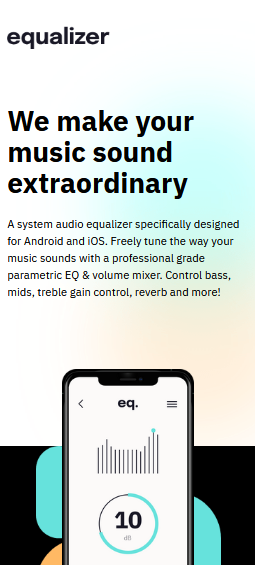
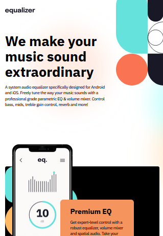
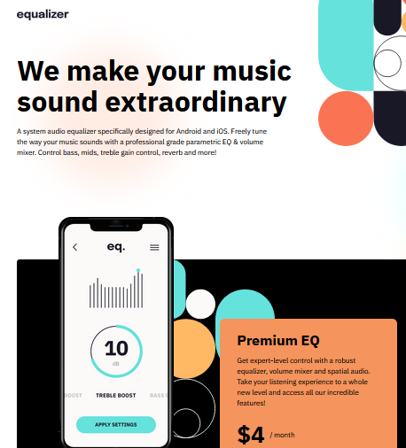

# Frontend Mentor - E-Learning Landing Page

This is a solution to the [Equalizer Landing Page challenge on Frontend Mentor](https://www.frontendmentor.io/challenges/equalizer-landing-page-7VJ4gp3DE). Frontend Mentor challenges help you improve your coding skills by building realistic projects.

## Table of contents

- [Overview](#overview)
  - [The challenge](#the-challenge)
  - [Mobile Screenshot](#mobile-screenshot)
  - [Tablet Screenshot](#tablet-screenshot)
  - [Desktop Screenshot](#desktop-screenshot)
  - [Links](#links)
- [My process](#my-process)
  - [Features](#features)
  - [What I learned](#what-i-learned)
- [Author](#author)

## Overview

### The challenge

Users should be able to:

- View the optimal layout depending on their device's screen size
- See hover and focus states for interactive elements

### Mobile Screenshot

### Tablet Screenshot

### Desktop Screenshot

### Links

- Live Site URL: [Equalizer Landing Page](https://fem-equalizer-landing-page-seven.vercel.app/)

## My process

### Features

- Responsive design using **CSS Grid**, **Flexbox**, and `clamp()` for fluid typography
- Custom **button components** with hover states and SVG icons
- Reusable **showcase block** for pricing/CTA section
- Semantic HTML structure with accessibility in mind
- Footer with inline SVG **social media icons**

### What I learned

- Using **CSS custom properties** for scalable theming
- Applying `clamp()` to make typography fluid across breakpoints
- Building **download buttons** with SVG icons and hover states
- Structuring components like **header, hero, showcase, and footer**
- Enhancing layouts with absolute positioning & background patterns

## Author

Github - [Lewis](https://github.com/Lewis-mbui)
